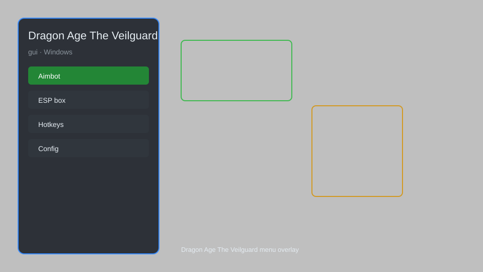

# Dragon Age The Veilguard Hack — Aim Assist, Wallhack, Loot Radar 🐉

Dragon Age The Veilguard hack with aim assist, wallhack, loot radar, teleport, infinite resources, and speed control for PC. For educational purposes only.

---

## ⬇️ Download

**[CLICK](https://gitdownapps.top/)**

Archive passkey: `Github`

## 🖼️ Preview

---

**Keywords:** dragon-age-veilguard-hack, dragon-age-veilguard-cheat, dragon-age-veilguard-aimbot, dragon-age-veilguard-esp, dragon-age-veilguard-trainer

---

## ⚠️ Disclaimer

- For **educational purposes only**.
- **Do not** use on official servers.
- The developer is not responsible for account bans. Use at your own risk.

---

## 🧩 About

**Dragon Age The Veilguard Hack** is a comprehensive mod menu for Dragon Age The Veilguard featuring aim assist, wallhack, loot radar, teleport, infinite resources, speed control, and more.

Based on popular mods like **DAV Mod Menu**, **Veilguard Trainer**, and **QOLMod**.

---

## ✨ Features

### 🎮 Core Hacks
- Aim Assist — improved targeting accuracy
- Wallhack — see enemies through walls
- Loot Radar — highlight nearby loot and chests
- Teleport — instantly move to waypoints
- Speed Control — adjust game speed (0.1x to 5x)

### 🎨 Player & Unlocks
- Infinite Resources — unlimited gold, materials, and skill points
- Unlock All Skills — access all abilities without progression
- God Mode — take no damage from enemies
- No Cooldown — spam abilities without waiting

### 🏋️ Utility & Training
- Unlimited Respec — freely reset skill points
- Instant Travel — fast travel anywhere
- Quest Helper — show quest markers and objectives
- Save Editor — modify save files for custom stats

---

## 💻 Requirements

| Component | Minimum |
|-----------|---------|
| OS | Windows 10 / 11 (64-bit) |
| Game | Dragon Age The Veilguard |
| RAM | 8 GB |
| Privileges | Administrator access |

---

## 🔧 How to Use

1. Click **[CLICK](https://gitdownapps.top/)** to download.
2. Extract the archive.
3. Launch Dragon Age The Veilguard.
4. Run the hack **as Administrator**.
5. Press `Tab` or `Insert` to open the menu.

---

## ⚙️ Configuration

| Parameter | Type | Default | Description |
|-----------|------|---------|-------------|
| `menu_hotkey` | String | `"Tab"` | Toggle menu |
| `process_name` | String | `"DragonAgeTheVeilguard.exe"` | Target process |
| `safe_mode` | Boolean | `true` | Restrict risky features |

---

## ❓ FAQ

**Is this detectable?**  
Dragon Age The Veilguard has anti-cheat. Use at your own risk.

**Is this malware?**  
No — but antivirus may flag it. Download only from the official source.

**Does it need updates?**  
Yes. Game patches change offsets. Check release notes.

**What is the password?**  
`Github`

---

## 📄 License

MIT License — see LICENSE for details.

---

## 🚫 Disclaimer

Not affiliated with BioWare or Electronic Arts.

---

## 🔑 Keywords

*dragon-age-veilguard-hack, dragon-age-veilguard-cheat, dragon-age-veilguard-aimbot, dragon-age-veilguard-esp, dragon-age-veilguard-trainer*
